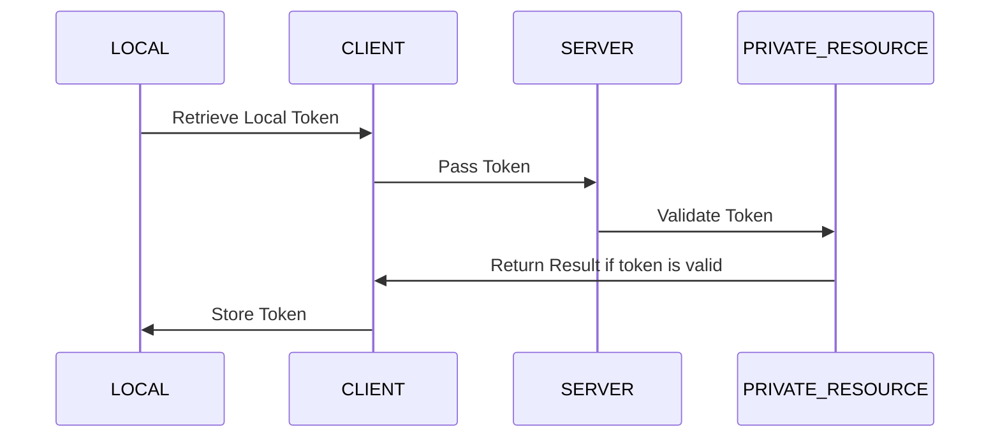
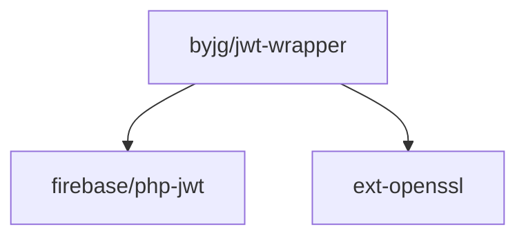

# JWT Wrapper

A simple and flexible wrapper around the Firebase JWT library that makes JWT token handling easy and intuitive in PHP applications.

[](https://github.com/byjg/php-jwt-wrapper/actions/workflows/phpunit.yml)
[](http://opensource.byjg.com)
[](https://github.com/byjg/php-jwt-wrapper/)
[](https://opensource.byjg.com/opensource/licensing.html)
[](https://github.com/byjg/php-jwt-wrapper/releases/)

## Features

- **Simple API**: Create and validate JWT tokens with minimal code
- **Flexible Signing**: Support for both HMAC (shared secret) and RSA/ECDSA (public/private key) methods
- **Automatic Claims**: Built-in handling of standard JWT claims (iat, exp, nbf)
- **HTTP Integration**: Helper methods for extracting tokens from HTTP headers
- **Key Management**: Intuitive interfaces for different key types

## Installation

```bash
composer require "byjg/jwt-wrapper"
```

## Quick Example

```php
// Create a JWT token using HMAC
$server = "example.com";
$secret = new \ByJG\JwtWrapper\JwtHashHmacSecret(base64_encode("your_secret_key"));
$jwtWrapper = new \ByJG\JwtWrapper\JwtWrapper($server, $secret);

// Add custom data and set expiration
$token = $jwtWrapper->generateToken(
    $jwtWrapper->createJwtData(["userId" => 123], 3600)
);

// Validate and extract data
try {
    $jwtData = $jwtWrapper->extractData($token);
    $userId = $jwtData->data->userId;
} catch (\ByJG\JwtWrapper\JwtWrapperException $e) {
    // Handle invalid token
}
```

## Documentation

Detailed documentation:

| Document                                       | Description                             |
|------------------------------------------------|-----------------------------------------|
| [Overview](docs/overview.md)                   | Introduction and core concepts          |
| [Key Types](docs/key-types.md)                 | HMAC and OpenSSL key configuration      |
| [Creating Tokens](docs/creating-tokens.md)     | Token generation and customization      |
| [Validating Tokens](docs/validating-tokens.md) | Token validation and data extraction    |
| [API Reference](docs/api-reference.md)         | Complete class and method documentation |


## Examples

The library includes complete examples in the `example` directory showing:

- Token creation with login.php
- Token validation with api.php
- Client-side usage with client.html



## Running the tests

```bash
vendor/bin/phpunit
```

## Dependencies



----
[Open source ByJG](http://opensource.byjg.com)

